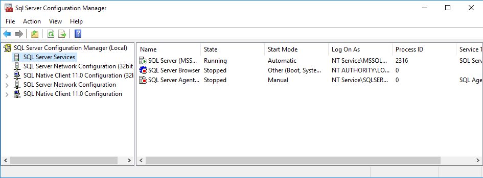
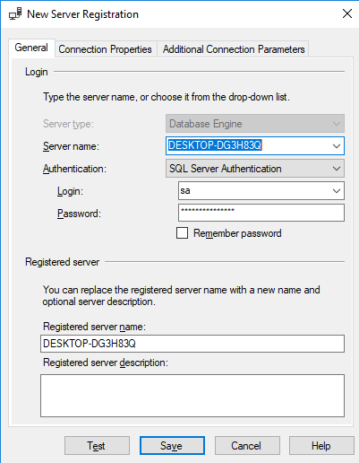
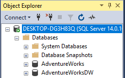
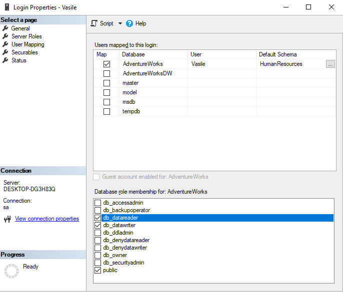
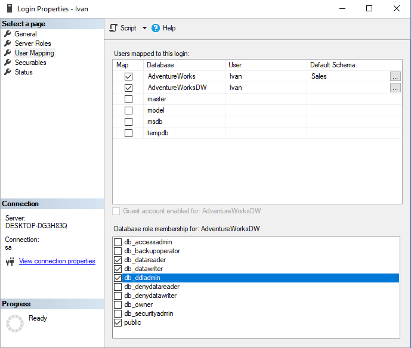
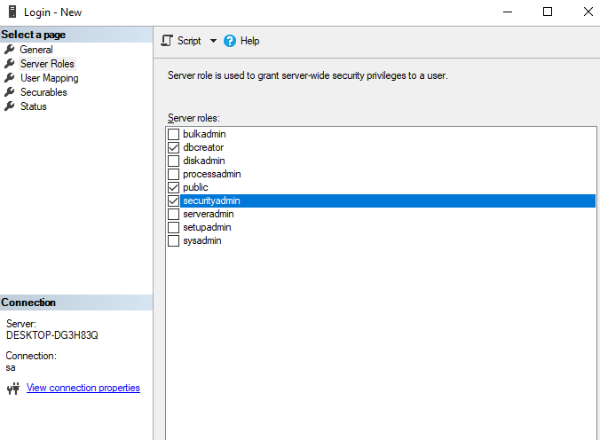

# Laboratory work nr. 1
-----
# Topic : *Installing and Configuring SQL Server 2017*
### Author : *Drumea Vasile*
-----
## Objectives :
1. Instalation of the software
2. Ability to work with database software

## Course of the work :
### Quiz :
1. In the client-server databeses the query is proccessed on the server, cluster or cloud and the terminal gets only the answer, this way the performance is way better.
2. Minimal hardware requirements for SQL Server 2017 are : 
  - Proccessor x64 1.4 GHz or more; 
  - RAM 1GB (4GB Recommended);
  - Resolution minimum 800x600;
  - OS Windows 8 or later;
3. Logic components of the system :
  - Databases;
  - Tables;
  - Database Diagrams;
  - Indexes;
  - Views;
  - Schemas;
  - Synonyms;
  - Stored Procedures; 
  - Triggers;
  - Functions;
  - Data Types;
  - Rules;
  - Sequences;
4. Authentification forms :
  - Windows Auth;
  - Mixt Auth;
5. Roles are used to separate the users in groups with different access rights;
6. A schema is a collection of database objects associated with one particular database username. This username is called the schema owner, or the owner of the related group of objects.

### Practical Assignments :
1. Install SQL Server 2017 : 

  
  
2. Register the server with SQL Auth :

  
  
3. Create 3 users using SQL Auth and with the given restrictions. In the following figures I've shown the special characteristics of each user, but first I've added the AdventureWorks databases : 

  
  
  And here are the figures of the users : 
  
  In the first case user Vasile can read and write in the table of the schema HumanResources from AdventureWorks2017 DB :
  
  
  
  In the second case user Ivan can read the table of the schema Sales from AdventureWorks2017 DB and can manage content from AdventureWorksDW2017 DB :
  
  
  
  In the third case user Vitalie can create new DBs and can restrict the acces to them :
  
  
  
  ## Conclusions : 
  
  1. In this laboratory work I've learnt the basic workflow with Microsoft SQL Server 2017 and its tools. Also its installation and Configuration.
  
  2. For a better management of the data in the databases are used roles to differentiate the users.
  
  3. It is a good practice to restrict the actions as much as possible to prevent spontanious and undesired events.
