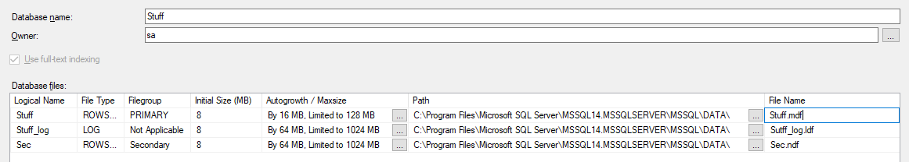
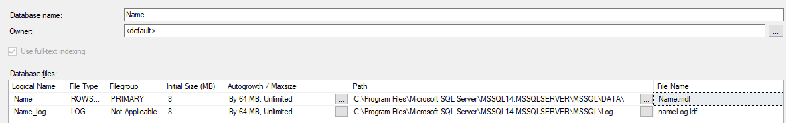
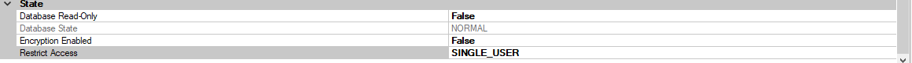

# Laboratory work nr. 2
-----
# Topic : *Database Creation and Maintanance Tools*
### Author : *Drumea Vasile*
-----
## Objectives :
1. Ability to create and maintain the database;
2. Ability to work with database software;

## Course of the work :
### Quiz :
1. The types of used files in Microsoft SQL Server 2017 are : Primary (.mdf), Secondary (.ndf), Log (.ldf).
2. Each Data Page begind with a header with meta data about the page itself. After this come the rows sequencially. 
3. System databases are used to maintain data about other databases, the system, the users and other important information which we are using in the workflow with SQL Server.
4. For creating a new databes we use the New Database option for Databases folder and then with the help of the creation window we specify the parameters, files and other information about the new database.
5. Maintanance plan is a plan used for good functioning other time of the database. It is used for backup if needed and testing of database performance. It can be created manually or with Maintanance Plan Wizard.

### Practical Assignments :
1. In the first assignment I've created the required database with the configuration as in the figure : 

 

2. For the second database here is the figure for the configuration : 

 
 
   And here I grant SingleUser usage :
 
 
 
3. 

## Conclusions : 

1. The creation of the database is a more complex proccess in which we should look forward and establish some features which can after influence the performance of our database.

2. 
