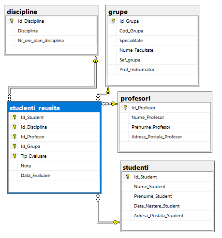
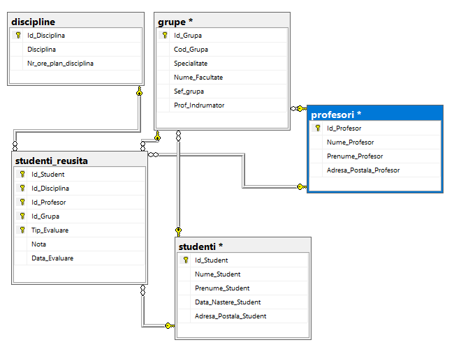
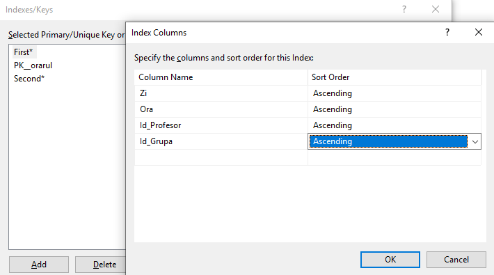
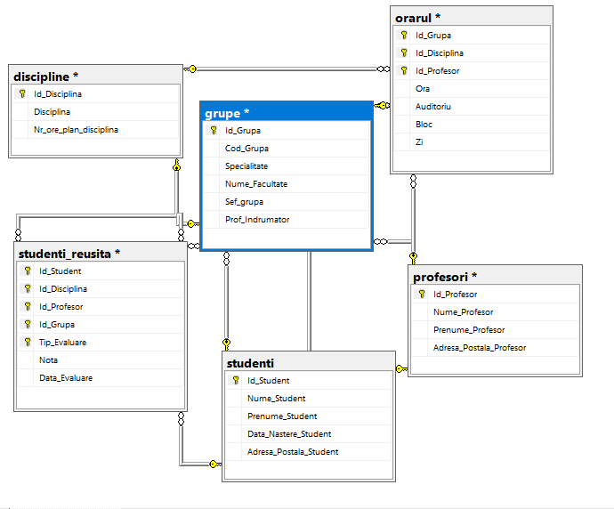

# Laboratory work nr. 7
-----
# Topic : *Diagrams, Schemes and Synonims*
### Author : *Drumea Vasile*
-----
## Objectives :
1. Get familiar with Diagrams, Schemes and Synonims;

## Course of the work :
### Quiz :

1. Diagrams are used in SQL Server with the scope of having an easier visualization of the database and its tables and also to have a quick access to the relations between tables and to the tables itselfs;

2. The use of Schemes offer us more advantages. For example these simplify the process of maintenation of the data and offer the possibility to create subsets which can be managed as a whole. These can be used to limit the seen objects for the user or a group of users.

3. Basic syntax to create a Schema

```
CREATE SCHEMA clause_name_schema [<element_schema> [...n]]
<clause_name_schema> ::= 
   { 
      name_schema
      <element_schema> [ ... n] ]
      I AUTHORIZATION name_owner
      I name_schema AUTHORIZATION name_owner }
      < element schema > ::=
      { definition_table I definition_view I give_rights
         take_rights I forbid_rights}
```

4. Before deleting a schema all the included objects should be moved or deleted. 

5. The synonim gives another name to an existing object. These create another abstractization level which protects the client app from modifying the basic objects.

6. Basic syntax to create a Synonim 

```
CREATE SYNONYM [ name_schema_1. ] name_synonym FOR < object >
< object > ::=
{
   [ name_server.[database].[name_schema_2].name_object
   I name database. [name_schema_2]. I name_schema_2.] nume_object
}
```

### Practical Assignments :
1. Create the diagram of university database, that will include the following tables: Profesori, Studenti, Studenti_reusita, Grupe, Discipline; 



2. Add the referential constraints with tables studenti and profesori for columns Sef_grupa and Prof_indrumator from table grupe;



3. Add the table orarul to the diagram;

4. Add secondary keys to the table orarul;



5. Also define FK-PK constraints to the table orarul;




## Conclusions : 

   There are many cases when we need to store values localy and use them after. For this we use variables. For decision making and repeating the same task multiple times we have alternative and repetitive structures. 
   
   Some times may appear exceptions and it is a good practice to use exception handlers. Also for debuging or other purpose Transact-SQL offers us a statement to raise an exception.
