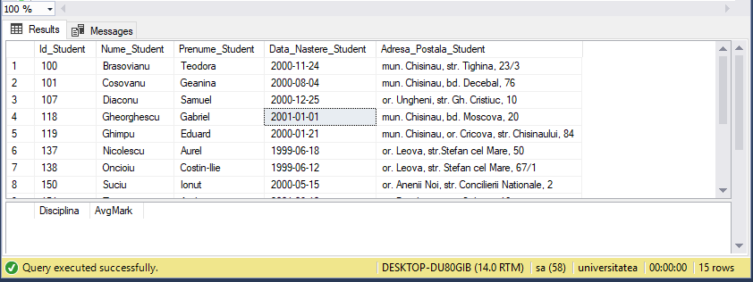

# Laboratory work nr. 8
-----
# Topic : *Management of views and table-expressions*
### Author : *Drumea Vasile*
-----
## Objectives :
1. Get familiar with views;
2. Sudy the table expressions; 

## Course of the work :
### Quiz :

1. Types of temporary tables : local and global;
2. The role of the views in databases is to visualize the data;
3. In SQL Server Views can be created by View Designer or by query;.
5. Basic syntax of creating views : 

```
CREATE VIEW [<nume_schema>.]<nume_viziune> [ (<coloana> [ , ... n] ) ]
   [WITH <atribute_viziune> [ , ... n] ]
   AS <instructiune select>
   [ WITH CHECK OPTION ] [ ; ]
   
<atribute viziunii> ::=
   { [ ENCRYPTION ]
     [ SCHEMABINDING ]
     [ VIEW METADATA ] }
```

6. Basic syntax of creating tabel-expression :

```
[WITH <expresie_tabel> [ , ... n] ]
   
<expresie_tabel>::=
   <nume_expresie> [ (<nume_coloana> [ , ... n] ) ]
   AS
   (<definitie_interogare_CTE>)
```

### Practical Assignments :
1. Create two visions based on the questions formulated in the two exercises indicated in the chapter4. The first view is built in the Query Editor, and the second, using ViewDesigner.




## Conclusions : 

   There are many cases when we need to store values localy and use them after. For this we use variables. For decision making and repeating the same task multiple times we have alternative and repetitive structures. 
   
   Some times may appear exceptions and it is a good practice to use exception handlers. Also for debuging or other purpose Transact-SQL offers us a statement to raise an exception.
