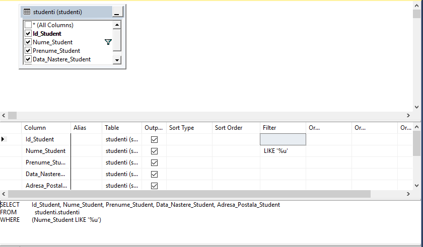
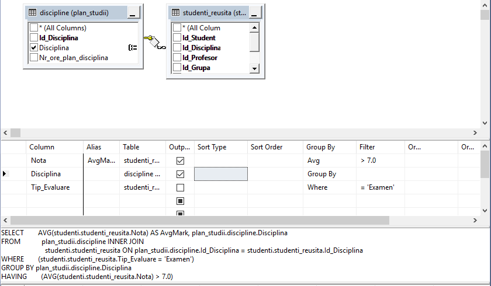

# Laboratory work nr. 8
-----
# Topic : *Management of views and table-expressions*
### Author : *Drumea Vasile*
-----
## Objectives :
1. Get familiar with views;
2. Sudy the table expressions; 

## Course of the work :
### Quiz :

1. Types of temporary tables : local and global;
2. The role of the views in databases is to visualize the data;
3. In SQL Server Views can be created by View Designer or by query;.
5. Basic syntax of creating views : 

```
CREATE VIEW [<nume_schema>.]<nume_viziune> [ (<coloana> [ , ... n] ) ]
   [WITH <atribute_viziune> [ , ... n] ]
   AS <instructiune select>
   [ WITH CHECK OPTION ] [ ; ]
   
<atribute viziunii> ::=
   { [ ENCRYPTION ]
     [ SCHEMABINDING ]
     [ VIEW METADATA ] }
```

6. Basic syntax of creating tabel-expression :

```
[WITH <expresie_tabel> [ , ... n] ]
   
<expresie_tabel>::=
   <nume_expresie> [ (<nume_coloana> [ , ... n] ) ]
   AS
   (<definitie_interogare_CTE>)
```

### Practical Assignments :
1. Create two visions based on the questions formulated in the two exercises indicated in the chapter4. The first view is built in the Query Editor, and the second, using ViewDesigner.

For the script see queries/query1.sql


With View Designer : 





2. Write an example of instructions INSERT, UPDATE, DELETE on created views. Add the relevant comments on the results of their execution instructions.

Comments: Insert, Update, Delete were done on rows of created views. Were inserted 3 rows with last column with "Undeva", which is student's address. With Update, one student got an address and with Delete, from one of left students with "Undeva", we deleted one with First Name "Botezatu"

3. Write the SQL statements that would change the views created (in exercise 1) in such a way that it is not possible to modify or delete the tables on which they are defined and the views not accept DML operations if the WHERE clause is not satisfied.

Comments: "WITH SCHEMABINDING " is used to prevent the error of a view table in case initial tables are modified and WITH CHECK OPTION we prevent DML operations related to WHERE clause state.

4. Write the test instructions for newly defined properties.

5. Write 2 exercises from Chapter 4, in the same way, that the nested queries to be rendered in the form of CTE expressions.

6. It is considered an oriented graph, as shown in the figure below, and you may want to go through the path from node id = 3 at the node where id = 0. Make the representation of the graph in the form of expression-recursive table. Note the instruction after UNION ALL of the recursive member, as well as the part up to UNION ALL represented by the anchor member.


## Conclusions : 

   There are many cases when we need to store values localy and use them after. For this we use variables. For decision making and repeating the same task multiple times we have alternative and repetitive structures. 
   
   Some times may appear exceptions and it is a good practice to use exception handlers. Also for debuging or other purpose Transact-SQL offers us a statement to raise an exception.
